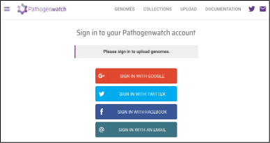
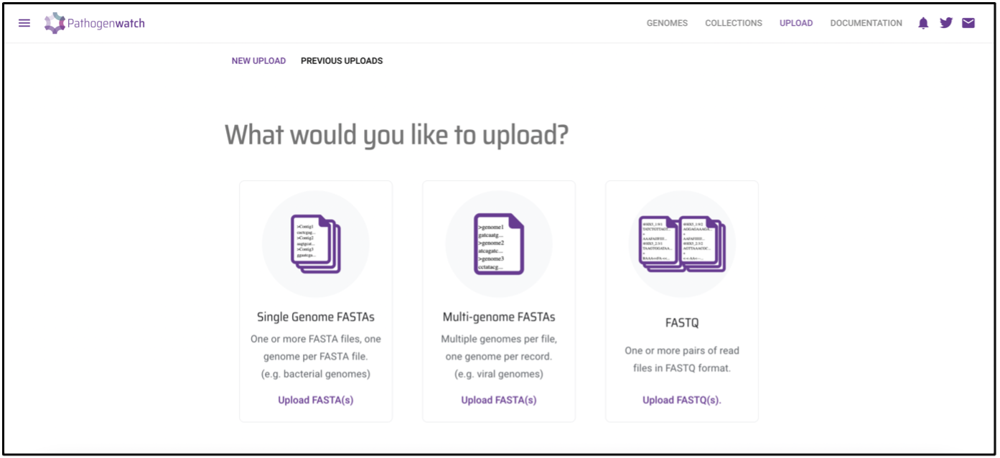
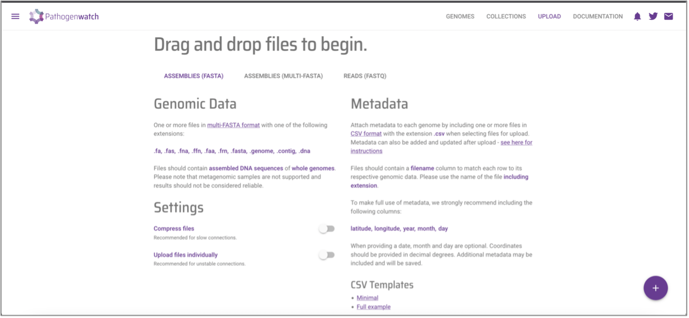
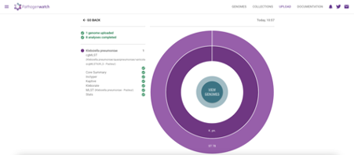
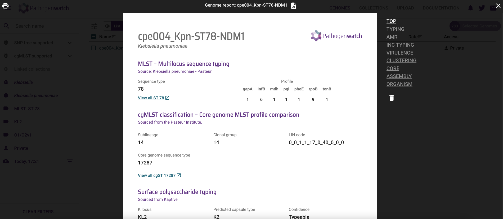
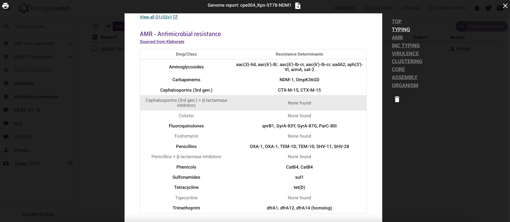

# Computational Practical 6: Detecting antimicrobial resistance from bacterial genomes


## Table of Contents
1. [Introduction](#intro)
2. [Expected learning outcomes](#outcomes)
3. [Bacterial strains to be analysed](#strains)
4. [WGS-based prediction of AMR using AMRFinderPlus](#amrfinder)
5. [WGS-based prediction of AMR using ResFinder](#resfinder)
6. [AMR detection using Pathogenwatch](#pathogenwatch)
7. [AMR detection using ResFinder Website – Optional](#resfinderw)
8. [AMR detection using CARD RGI Website – Optional](#card)
9. [Adding genotypic antibiogram of CPE strains into EpiCollect](#epicollect)

---

## Introduction <a name="intro"></a>

Growing rates of antimicrobial resistance make antibiotic susceptibility testing (AST) increasingly needed to ensure the right antibiotics are prescribed for patients with bacterial infections. Determining antibiotic susceptibility is preferred over empiric therapy, wherein typically broad-spectrum drugs are used without a definitive confirmation of the infectious agent and which antibiotics infectious bacteria are resistant to. Data collected on antibiograms (strains’ full susceptibility pattern) can also be used for surveillance purposes and, in turn, inform empiric therapy.

AST is routinely performed using culture-based techniques in clinical diagnostic laboratories, frequently disk diffusion, broth microdilution and gradient diffusion (i.e., E-test). As antibiotic resistance is genetically encoded, i.e. mediated by acquisition of new genes, gene copy number, or mutations in regulatory and coding regions of existing chromosomal genes, molecular tests have been developed to target the detection of such genetic markers. In the last decade, whole-genome sequencing has emerged as an alternative technology to both culture and targeted molecular tests for the detection of AMR as it can, in principle, detect all AMR genetic determinants and predict resistance to all antibiotics in a single experiment. The accuracy of genotypic predictions depends on the availability of: (1) accurate databases of AMR genetic determinants, (2) large collections of whole-genome sequenced strains with AST measurements to assess the diagnostic accuracy of such catalogues, and (3) automated genome analysis and interpretation tools.

Mutational (chromosomal) resistance is the main driver of acquired resistance in certain bacterial species, such as *Mycobacterium tuberculosis* and *Helicobacter pylori*, or for particular antibiotics, especially to synthetic agents such as fluoroquinolones and oxazolidinones. Resistance mutations are vertically transmitted, i.e., via clonal reproduction of bacteria, or can be transmitted horizontally via homologous recombination between different strains. Gene-mediated resistance is the main driver of acquired resistance in certain bacterial species, particularly in gram-negatives. Resistance genes can be horizontally transmitted (via mobile genetic elements such as plasmids) and vertically transmitted via clonal reproduction of bacteria, particularly stable if integrated into the chromosome. In some bacterial species, chromosomal and gene-mediated resistance are equally common (e.g., *Staphylococcus aureus*). Resistance to the same antibiotic can be conferred by both mutations and acquired genes (e.g., fusidic acid in Staphylococcus aureus, colistin resistance in *Escherichia coli*).

Over the years, several global studies have identified the genes and mutations that confer resistance to particular antibiotics. There are several databases such as the [Comprehensive Antimicrobial Resistance Database (CARD)](https://card.mcmaster.ca/), [ResFinder](https://cge.cbs.dtu.dk/services/ResFinder/), [AMRFinde](https://www.ncbi.nlm.nih.gov/pathogens/antimicrobial-resistance/AMRFinder/) or [Pathogenwatch](https://pathogen.watch/) that contain information about the genes and mutations that confer resistance. The use of these databases and tools depends on the species and mechanisms of resistance one is interested in.

## Expected learning outcomes <a name="outcomes"></a>

After this practical session, you should be able to:
- Run broadly used command-line bioinformatic tools like AMRFinder and ResFinder to detect AMR from bacterial genome data;
- Interpret the AMR reports and AMR genetic determinants identified by these tools and their relationship with phenotypic AMR;
- Identify the strengths, limitations, and differences in functionaly and predictions among these tools;
- Employ popular online-based tools like Pathogenwatch or ResFinder to detect AMR from bacterial genome data.

## Bacterial strains to be analysed in this practical <a name="strains"></a>

Table 1 contains the list of strains to be analysed in this practical from the CPE outbreak we will be investigating this year. Table 2 contains additional strains to be analysed (optionally, if time allows) sourced from key studies on the genomic epidemiology of methicillin-resistant *Staphylococcus aureus* (MRSA) ([Holden *et al.* 2013](https://doi.org/10.1101/gr.147710.112)) and extensively drug-resistant (XDR) *Salmonella typhi* ([Klemm *et al.* 2018](https://doi.org/10.1128/mbio.00105-18)). In this practical we will use three different command-based tools (AMRFinder, ResFinder and CARD RGI) to identify AMR genetic determinants from whole-genome sequences. In later computational practicals we will explore the epidemiology of outbreaks and epidemic clones of these bacteria, and study the strains investigated in this practical in a broader context. We will also identify the genomic context of AMR genes, for example, if they are carried on mobile genetic elements.

Table 1 CPE strains to be analysed in this practical
| Species | Study and origin | Strain Id | Illumina accession | Assembly file name |
| :---    | :---             | :---      | :---               | :---      |     
| *K. pneumoniae* | Roberts *et al.* 2024, CPE strain | cpe004 | ERR4095909 | cpe004_Kpn-ST78-NDM1.fasta |
| *E. coli* | Roberts *et al.* 2024, CPE strain | cpe069 | ERR5386320 | cpe069_Eco-NDM1.fasta |

Table 2 Additional strains to be analysed (optional).
| Species	| Study and origin | Strain Id | Genome accession | Assembly file name | 
| :---    | :---             | :---      | :---               | :---      |     
| *S. aureus*	| Holden *et al.* 2013, Berlin (Germany), 2007, ST22 EMRSA-15 | 07-02477 | ERR017261  | ERR017261.assembly.fa |
| *S. aureus*	| Holden *et al.* 2013, UK, 2005, ST22 EMRSA-15	| HO50960412 | HE681097 (GenBank) | HO50960412.fa |
| *S. typhi*	| Klemm *et al.* 2018 (ACT), Pakistan, 2016, 4.3.1 (H58) XDR | BL0006 | ERR2093245	| ERR2093245.assembly.fa |
| *S. typhi* | Klemm *et al.* 2018, Pakistan (2016) – 4.3.1 (H58) pre-XDR	| Pak60168 | ERR2093329	|ERR2093329.assembly.fa |

First of all, launch the Docker image on your machine:

If you haven’t done so already, clone the course Github directory into your home directory:

```bash
docker run -it --mount type=bind,source=C:\Users\4M\Desktop\data,target=/home/data amr:Dockerfile
```

Navigate to directory `home/data/`, download the course data, and create a new directory for this practical named `cp6`:

```bash
cd home/data/
git clone https://github.com/WCSCourses/AMR_2025/
mkdir cp6
```

Next, copy the genome assemblies we will use (i.e., those in Tables 1 and 2) into cp6 directory:
```bash
cp ./AMR_2025/course_data_2025/cp6/complete_assemblies/cpe004_Kpn-ST78-NDM1.fasta ./cp6/
cp ./AMR_2025/course_data_2025/cp6/complete_assemblies/cpe069_Eco-NDM1.fasta ./cp6/
```

Copy the genome assemblies of the additional strains in Table 2 (the analysis of these strains is optional):
```bash
cp ./AMR_2025/course_data_2025/cp6/additional_genomes/HO50960412.fa ./cp6/
cp ./AMR_2025/course_data_2025/cp6/additional_genomes/ERR017261.assembly.fa ./cp6/
cp ./AMR_2025/course_data_2025/cp6/additional_genomes/ERR2093245.assembly.fa ./cp6/
cp ./AMR_2025/course_data_2025/cp6/additional_genomes/ERR2093329.assembly.fa ./cp6/
```

Also, identify and copy the genome assembly of **your assigned CPE strain** (the one on your EpiCollect sheet).

Finally, navigate to the module folder `cp6` where you should find the genome assemblies you just copied:
```bash
cd cp6
```

## 4. WGS-based prediction of AMR using AMRFinderPlus <a name="amrfinder"></a>

### Introduction to AMRFinderPlus

To enable accurate assessment of AMR gene content, as part of a multi-agency collaboration, the National Center for Biotechnology Information (NCBI) in the US developed a comprehensive AMR gene database, the Bacterial Antimicrobial Resistance Reference Gene Database, and AMRFinder, an AMR gene detection tool.9 Recently, NCBI released a new version of AMRFinder, known as AMRFinderPlus that, among several new functionalities, has been expanded to detect point mutations in both protein and nucleotide sequences, and taxon-specific analyses that include, or exclude, certain genes and point mutations for specific taxa. [AMRFinderPlus](https://github.com/ncbi/amr) is available on as a command-line tool only. In this section we will run AMRFinderPlus on the same strain genomes analysed with ResFinder and CARD RGI in previous sections.

### AMRFinderPlus commands

The only required arguments to run AMRFinderPlus are either ```-p <protein_fasta>``` for proteins or ```-n <nucleotide_fasta>``` for nucleotides. Use ```--help``` to see the complete set of options and flags.

```bash
amrfinder --help
```

Use ‘amrfinder -u’ to download and prepare database for AMRFinderPlus:

```bash
amrfinder -u
```

First, a local database of the latest the latest AMR database must be download.

```bash
mkdir amrfinder_db
amrfinder_update -d ./amrfinder_db
```

After making sure the latest AMR database is downloaded, you can run amrfinder on genome assemblies, as showed in the command line below:

```bash
amrfinder -n cpe004_Kpn-ST78-NDM1.fasta -O Klebsiella_pneumoniae -o cpe004_Kpn-ST78-NDM1_amrfinder.txt
```

We will change the default delimiter of AMRFinder output file to make it easier to open with Excel:

```bash
cat cpe004_Kpn-ST78-NDM1_amrfinder.txt | tr '\t' ',' > cpe004_Kpn-ST78-NDM1_amrfinder.csv
```

The command above will run amrfinder on the *Klebsiella pneumoniae* strain cpe004 we created an assembly for in previous practicals.

It should take a few minutes for this command to finish.

From the command above, note the following chosen options:
- AMRFinder only supports the processing of input nucleotide sequences in FASTA format (with the ```-n/--nucleotide``` option), and not the analysis of raw reads in fastq format. This means that raw reads must be de novo assembled first.
- The option ```-o/--output``` allows you to choose the name of the output file.
- One of the strengths of AMRFinfer is the option ```-O/--organism``` which can be used to get organism-specific results. For those organisms which have been curated, using ```--organism``` will get optimized organism-specific results, and it is therefore recommended. AMRFinderPlus uses the ```--organism``` for screening for point mutations and to filter out genes that are nearly universal in a group and uninformative.

Use ```amrfinder -l``` to list the organism options supported by AMRFinder:

```bash
amrfinder -l
```

You will find taxa like ‘Klebsiella_pneumoniae’, ‘Staphylococcus_aureus’ or ‘Salmonella’ included among the list of supported organisms.

The command below will execute AMRFinder on our CPE *E. coli* strain of interest (Table 1):
```bash
amrfinder -n cpe069_Eco-NDM1.fasta -O Escherichia -o cpe069_Eco-NDM1_amrfinder.txt
```
```bash
cpe069_Eco-NDM1_amrfinder.txt | tr '\t' ',' > cpe069_Eco-NDM1_amrfinder.csv
```
Now adapt and run the amrfinder command above on your assigned outbreak strain. First, identify and copy the hybrid assembly of your assigned strain into your working directory. Second, make sure to choose the right organism with the parameter ```-O```.

It time allows, come back to this section later to run AMRFinder on the additional strains:
```bash
amrfinder -n HO50960412.fa -O Staphylococcus_aureus -o HO50960412_amrfinder.txt
amrfinder -n ERR017261.assembly.fa -O Staphylococcus_aureus -o ERR017261_amrfinder.txt
amrfinder -n ERR2093245.assembly.fa -O Salmonella -o ERR2093245_amrfinder.txt
amrfinder -n ERR2093329.assembly.fa -O Salmonella -o ERR2093329_amrfinder.txt
```
```bash
cat HO50960412_amrfinder.txt | tr '\t' ',' > HO50960412_amrfinder.csv
cat ERR017261_amrfinder.txt | tr '\t' ',' > ERR017261_amrfinder.csv
cat ERR2093245_amrfinder.txt | tr '\t' ',' > ERR2093245_amrfinder.csv
cat ERR2093329_amrfinder.txt | tr '\t' ',' > ERR2093329_amrfinder.csv
```

### Interpreting AMRFinderPlus results

The table below includes a few rows and some of the columns of the AMRFinderPlus output of *Klebsiella pneumoniae* strain cpe004 (file cpe004_Kpn-ST78-NDM_amrfinder.txt).

| Gene symbol | Sequence name | Element subtype | Subclass |
| :---        | :---          | :---            | :---     |  
| aph(3')-VI	| APH(3')-VI family aminoglycoside O-phosphotransferase	| AMR | AMIKACIN/KANAMYCIN |
| aac(6')-Ib-cr5	| fluoroquinolone-acetylating aminoglycoside 6'-N-acetyltransferase AAC(6')-Ib-cr5 | AMR | AMIKACIN/KANAMYCIN/QUINOLONE/TOBRAMYCIN |
| aac(6')-Ib-cr5 | fluoroquinolone-acetylating aminoglycoside 6'-N-acetyltransferase AAC(6')-Ib-cr5	| AMR | AMIKACIN/KANAMYCIN/QUINOLONE/TOBRAMYCIN |
| aac(6')-Ib	| AAC(6')-Ib family aminoglycoside 6'-N-acetyltransferase	| AMR	| AMIKACIN/KANAMYCIN/TOBRAMYCIN |

The column ‘Gene symbol’ indicates the genetic determinant (either acquired gene or point mutation) associated with phenotypic resistance, the latter indicated in the column ‘Subclass’.

Based on AMRFinderPlus output files, fill in the tables in the Word document **Summary of genotypic AMR results - CPE strains.docx** (Figure 1) to facilitate comparison of WGS-predicted antibiograms between tools.

  
**Figure 1.** Summary of genotypic and phenotypic antibiogram for K. pnemoniae cpe004 strain.

## 5. WGS-based prediction of AMR using ResFinder <a name="resfinder"></a>

### Introduction to ResFinder

ResFinder, developed by [Center for Genomic Epidemiology at the Technical University of Denmark](http://www.genomicepidemiology.org/), is a freely accessible tool to identify acquired genes and/or chromosomal mutations mediating antimicrobial resistance in total or partial DNA sequence of bacteria. Published in 2012 for the first time [Zankari *et al.* 2012](https://doi.org/10.1093/jac/dks261), ResFinder was the first web-based bioinformatics tool developed to provide detection of AMR genes in WGS, aimed at users without specialized bioinformatic skills. A [command-line](https://bitbucket.org/genomicepidemiology/resfinder/) version was later developed which allows the automation of ResFinder analyses within bioinformatic scripts. The authors claim [Florensa *et al.* 2022](https://doi.org/10.1099/mgen.0.000748) ResFinder has been executed more than 800,000 times from more than 61,000 different users in over 171 countries (web-based version, September 2021).

ResFinder, originally developed to detect acquired AMR genes, was later expanded with PointFinder [Zankari *et al.* 2017](https://doi.org/10.1093/jac/dkx217), a tool that detects chromosomal point mutations mediating resistance to selected antimicrobial agents. Recently, additional databases were developed to link each AMR determinant with phenotypic resistance to specific antimicrobial compounds, and species-specific panels for in silico antibiograms. ResFinder 4.0 [Bortolaia *et al.* 2020](https://doi.org/10.1093/jac/dkaa345) was validated for several bacterial species including *Salmonella spp.* and *Staphylococcus aureus* strains with a diversity of AST profiles, human and animal sources and geographical origins.

### ResFinder commands

ResFinder can analyse both paired-end Illumina reads in fastq.gz format and genome assemblies in FASTA format.

Execute the command below to display all ResFinder arguments and options:
```bash
python -m resfinder --help
```

Next, if not already available, download a local copy of the latest ResFinder databases:
```bash
git clone https://bitbucket.org/genomicepidemiology/resfinder_db/
git clone https://bitbucket.org/genomicepidemiology/pointfinder_db/
git clone https://bitbucket.org/genomicepidemiology/disinfinder_db/

# Local databases need to be indexed using kma:
cd resfinder_db
python3 INSTALL.py kma_index
cd ..
cd pointfinder_db
python3 INSTALL.py kma_index
cd ..
cd disinfinder_db
python3 INSTALL.py kma_index
cd ..
```

Set approximate environment bash variables for ResFinder executable to locate these databases.
```bash
export CGE_RESFINDER_RESGENE_DB="/home/data/cp6/resfinder_db";
export CGE_RESFINDER_RESPOINT_DB="/home/data/cp6/pointfinder_db";
export CGE_DISINFINDER_DB="/home/data/cp6/disinfinder_db";
```

Remember to set these variables in any new terminal window. Otherwise ResFinder will exist with the error: ‘Could not locate ResFinder database path’.

Now everything is set to run ResFinder on your terminal screen as shown in the commands below:
```bash
python -m resfinder -ifa cpe004_Kpn-ST78-NDM1.fasta -s "Klebsiella" --acquired --point --outputPath cpe004_Kpn_resfinder
python -m resfinder -ifa cpe069_Eco-NDM1.fasta -s "Escherichia coli" --acquired --point --outputPath cpe069_Eco_resfinder
```

Let's now change the delimiter of ResFinder output files to make it easier to open in Excel:
```bash
cat ./cpe004_Kpn_resfinder/ResFinder_results_tab.txt | tr '\t' ',' > ./cpe004_Kpn_resfinder/ResFinder_results_tab.csv
cat ./cpe004_Kpn_resfinder/pheno_table.txt | tr '\t' ',' > ./cpe004_Kpn_resfinder/pheno_table.csv
cat ./cpe069_Eco_resfinder/ResFinder_results_tab.txt | tr '\t' ',' > ./cpe069_Eco_resfinder/ResFinder_results_tab.csv
cat ./cpe069_Eco_resfinder/pheno_table_escherichia_coli.txt | tr '\t' ',' > ./cpe069_Eco_resfinder/pheno_table_escherichia_coli.csv
```


<!--- 
IMPORTANT NOTE: if ResFinder database could not be found (```‘Could not locate ResFinder database path’```, you can use the option ```--db_path_res``` to indicate where the directory of such database is:

```bash
python -m resfinder -ifa cpe004_Kpn-ST78-NDM1.fasta -s "Klebsiella" --acquired --point --outputPath cpe004_Kpn_resfinder --db_path_res ./resfinder_db
```

```bash
python -m resfinder -ifa cpe069_Eco-NDM1.fasta -s "Escherichia coli" --acquired --point --outputPath cpe069_Eco_resfinder --db_path_res ./resfinder_db
```
---> 

The command line above was used to run ResFinder on the genome assembly of *Klebsiella pneumoniae* cpe004 and *Escherichia coli* cpe069 strains (Table 1). Note the following parameters:
- the option ```-ifa``` is used to indicate that the input genome is provided in FASTA format, following by the path to the genome assembly file we want to analyse;
- the option ```-s``` is used to indicate the bacterial species in the same. This is important for ResFinder to use the antimicrobial panel specific to each bacterial species;
- the option ```--acquired``` is chosen to detected acquired resistance genes, and;
- the option ```--point``` to scan for AMR chromosomal mutations;
- the option ```--outputPath``` allows you to specify the name of the output directory where ResFinder files will be stored

Next, we will run ResFinder on the raw sequencing reads of strain cpe004 (Illumina accession number ERR4095909).

fastq.gz files can be downloaded directly from the ENA using their FTP links (https://www.ebi.ac.uk/ena/browser/view/ERR4095909):
```bash
wget https://ftp.sra.ebi.ac.uk/vol1/fastq/ERR409/009/ERR4095909/ERR4095909_1.fastq.gz
wget https://ftp.sra.ebi.ac.uk/vol1/fastq/ERR409/009/ERR4095909/ERR4095909_2.fastq.gz
```

In the ResFinder command below note we used the same options as for sample cpe004 except for ‘-ifq’, used here to specify input fastq file(s). ResFinder assumes the input to be single-end fastq if only one file is provided after ‘-ifq’, and to be paired-end data if two files are provided instead.

```bash
python -m resfinder -ifq ERR4095909_1.fastq.gz ERR4095909_2.fastq.gz -s "Klebsiella" --acquired --point --outputPath cpe004_ERR4095909_resfinder
```

If you could not download the fastq.gz files of sample ERR4095909, remember you can run ResFinder on its assembly file (cpe004_Kpn-ST78-NDM1.fasta) as done earlier.

### Optional - if time allows

You can use the commands below to run ResFinder for the *S. aureus* samples:
```bash
python -m resfinder -ifa HO50960412.fa -s "Staphylococcus aureus" --acquired --point --outputPath HO50960412_resfinder
python -m resfinder -ifa ERR017261.assembly.fa -s "Staphylococcus aureus" --acquired --point --outputPath ERR017261_resfinder
```

You can use the commands below to run ResFinder for the *S. typhi* samples:
```bash
python -m resfinder -ifa ERR2093245.assembly.fa -s "Salmonella enterica" --acquired --point --outputPath ERR2093245_resfinder
python -m resfinder -ifa ERR2093329.assembly.fa -s "Salmonella enterica" --acquired --point --outputPath ERR2093329_resfinder
```

Let's now change the delimiter of ResFinder output files to make it easier to open in Excel:
```bash
cat ./HO50960412_resfinder/ResFinder_results_tab.txt | tr '\t' ',' > ./HO50960412_resfinder/ResFinder_results_tab.csv
cat ./HO50960412_resfinder/pheno_table_staphylococcus_aureus.txt | tr '\t' ',' > ./HO50960412_resfinder/pheno_table_staphylococcus_aureus.csv

cat ./ERR017261_resfinder/ResFinder_results_tab.txt | tr '\t' ',' > ./ERR017261_resfinder/ResFinder_results_tab.csv
cat ./ERR017261_resfinder/pheno_table_staphylococcus_aureus.txt | tr '\t' ',' > ./ERR017261_resfinder/pheno_table_staphylococcus_aureus.csv

cat ./ERR2093245_resfinder/ResFinder_results_tab.txt | tr '\t' ',' > ./ERR2093245_resfinder/ResFinder_results_tab.csv
cat ./ERR2093245_resfinder/pheno_table_salmonella_enterica.txt | tr '\t' ',' > ./ERR2093245_resfinder/pheno_table_salmonella_enterica.csv

cat ./ERR2093329_resfinder/ResFinder_results_tab.txt | tr '\t' ',' > ./ERR2093329_resfinder/ResFinder_results_tab.csv
cat ./ERR2093329_resfinder/pheno_table_salmonella_enterica.txt | tr '\t' ',' > ./ERR2093329_resfinder/pheno_table_salmonella_enterica.csv
```

### Interpreting ResFinder results

Based on the ResFinder commands run in the previous section, you should have obtained a ‘_resfinder’ output directory for each of the samples analysed. Out of the various output files, the following ones are key for interpretation:

- ```ResFinder_results_table.txt```: summary of detected acquired AMR genes by antibiotic class, including BLAST statistics such as percentage of nucleotide identity or percentage of gene length covered.
- ```PointFinder_table.txt```: summary of chromosomal genes scanned for AMR point mutations for the chosen bacterial species.
- ```PointFinder_results.txt```: detected AMR chromosomal point mutations in your sample, and associated phenotypic resistance.
- ```pheno_table_[species].txt```: ResFinder (including PointFinder) WGS-predicted phenotypes for the bacterial species chosen, including the detected genetic determinants supporting such prediction.
- ```pheno_table.txt```: ResFinder (including PointFinder) WGS-predicted phenotypes for all antibiotics included in this database. These results should be interpreted with caution, and the file pheno_table_[species].txt prioritised for reporting.

**IMPORTANT**: Out of all these output files, we should focus on ```pheno_table_[species].txt```, as it contains WGS-predicted phenotypes that are specific for the chosen bacterial species. Also, look at file PointFinder_results.txt to extract AMR point mutations.

Based on the ResFinder output files, fill in the tables in the Word document **Summary of genotypic AMR results - CPE strains.docx** (Figure 1) to facilitate comparison of WGS-predicted antibiograms between tools.

<!---
## 6. AMR detection using Pathogenwatch <a name="pathogenwatch"></a>

(Pathogenwatch)[https://pathogen.watch/] is one of most intuitive an easy-to-use web-based platforms for the analysis of bacterial genomes, developed by The Centre for Genomic Pathogen Surveillance (CGPS), UK, that can be used to detect AMR in the genomes of many bacterial pathogens (but not all). You will be provided with pre-generated genome assemblies that can be directly uploaded as input to this tool. Once uploaded, Pathogenwatch performs strain identification, multi-locus sequence typing (MLST) and resistance prediction in an automated manner. Recently, the website was upgraded with the option to upload raw sequencing reads (those obtained directly from sequencing machines without further bioinformatic processing), but as the upload and analysis of raw reads takes much longer, we will be upload the genome assemblies provided instead.

Open the (website)[https://pathogen.watch/] on a new Firefox tab. Click on the “upload” button at the top right corner as indicated by the arrow in **Figure 1**.
  
**Figure 1.** Pathogenwatch home page.

You will need to sign in using one of the available options (**Figure 2**) before you can upload any genomes.

  
**Figure 2.** Pathogenwatch log in options.

Once logged in, a new window with genome upload options will appear as shown in **Figure 3**.

  
**Figure 3.** Pathogenwatch genome upload options.

Click on the ‘Single Genome FASTAs’ option and select the genome assembly file of the **_Klebsiella pneumoniae_ strain cpe004**. Next, a new window with upload information will appear (**Figure 4**). Click on the ‘Add files’ button to open the file browser and select the file ```cpe004_Kpn-ST78-NDM1.fasta```. The file will be uploaded and the analysis will begin automatically.

  
**Figure 4.** Pathogenwatch genome upload information.

The new page (**Figure 5**) will show the status of the different genome analyses being conducted by Pathogenwatch on the background. Click on “**View Genomes**” once all analyses have finalised as pointed by the arrow. In the next window, click on “**View report**”.


**Figure 5.** Pathogenwatch page on analysis status.

The Pathogenwatch genome report (**Figure 6**) contains information on multi-locus sequence typing (MLST) at the top (TYPING) followed by antimicrobial resistance (AMR), and quality control (QC) stats. Spend some time familiarising yourself with the sections and content of the report and ask your instructor for clarifications if needed.

  
**Figure 6.** Pathogenwatch genome report for _Klebsiella pneumoniae_ strain cpe004.

Now click on the AMR section of the report (arrow in **Figure 7**). Scroll down and pay particular attention to the ‘Resistance determinants’, that is, the AMR genes and mutations detected in the genome assembly of our strain of interest. Spend some time exploring the AMR report, compare these results with those obtained with AMRFinder and ResFinder for strain cpe004.

  
**Figure 7.** AMR report for _Klebsiella pneumoniae_ strain cpe004.

Finally, upload the genome assembly of **_E. coli_ cpe069** strain and that of **your assigned CPE strain** by repeating all previous steps (Figures 3 to 6).

### Optional - if time allow
Additionally, obtain the Pathogenwatch report for the two additional *S. aureus* (from genome assembly files ``HO50960412.fa`` & ``ERR017261.assembly.fa``) and the two *S. typhi* strains (from genome assembly files ``ERR2093245.assembly.fa`` & ``ERR2093329.assembly.fa``).
--->

## 6. AMR detection using Pathogenwatch <a name="pathogenwatch"></a>

See section in PDF manual `2025_Detecting AMR from genomes - online tools.pdf`

## 7. AMR detection using ResFinder Website – Optional <a name="resfinderw"></a>

See section in PDF manual `2025_Detecting AMR from genomes - online tools.pdf`

## 8. AMR detection using CARD RGI Website - Optional <a name="card"></a>

See section in PDF manual `2025_Detecting AMR from genomes - online tools.pdf`

## 9. Adding genotypic antibiogram of CPE strains into EpiCollect <a name="epicollect"></a>

See instructions in PDF manual `Adding genotypic antibiogram EpiCollect.pdf`


